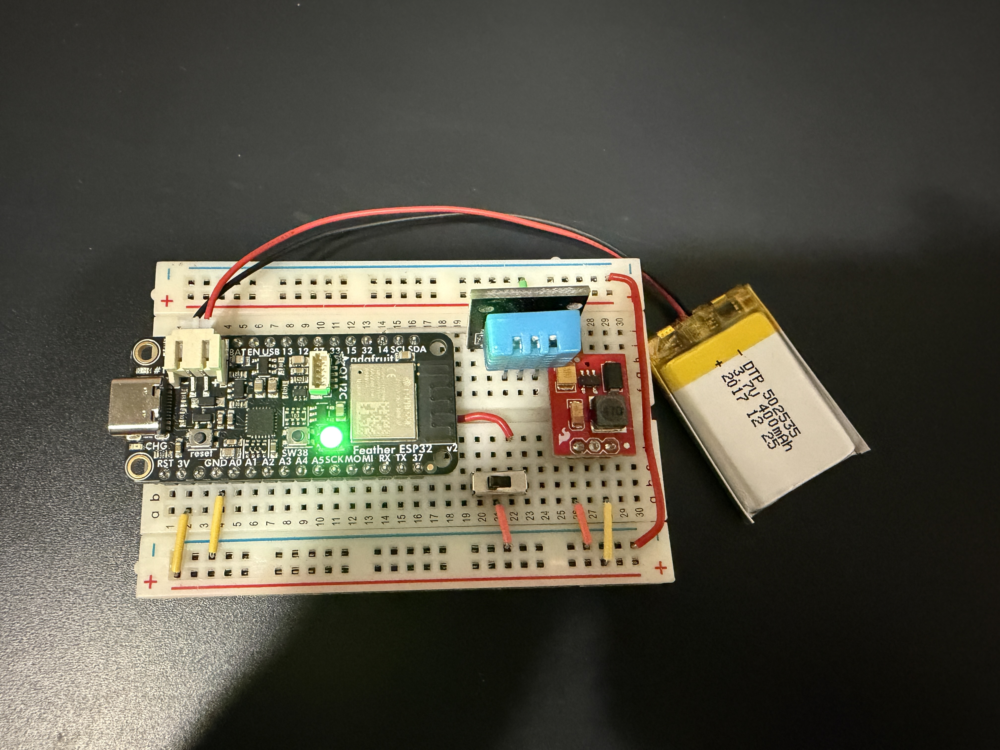

# ESP32 Feather V2 + DHT11 Temperature & Humidity Monitor

A WiFi-enabled temperature and humidity monitor using the Adafruit ESP32 Feather V2 and DHT11 sensor.

## Features

- **Web Dashboard** — Real-time temperature and humidity display with auto-refresh
- **JSON API**
- **OTA Updates**
- **Status LED** — Onboard NeoPixel

## Hardware

#### Components

| Part | Description |
|------|-------------|
| Adafruit ESP32 Feather V2| Main microcontroller |
| DHT11 (3-pin breakout)  | Temperature & humidity sensor |
| 5V Step-up| Boosts 3V to 5V |
| Switch | Power on/off via EN-GND |

#### Wiring

| Connection | From           | To             |
|------------|----------------|----------------|
| Power In   | ESP32 3V       | Step-up VIN    |
| Power Out  | 5V Step-up     | DHT11 VCC (+)  |
| Data       | DHT11 DATA (S) | ESP32 GPIO 14  |
| Ground     | ESP32 GND      | DHT11 GND (-)  |
| Switch     | ESP32 EN       | ESP32 GND (-)  |

> Note: 3-pin breakout boards have a built-in pull-up resistor. If using a raw DHT11, add a 10kΩ resistor between DATA and VCC.